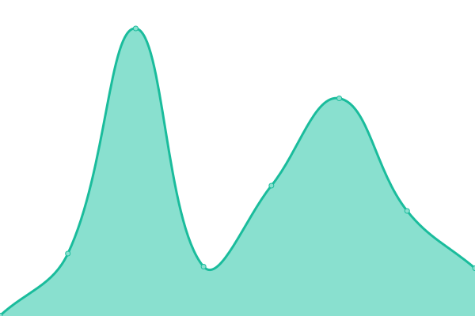
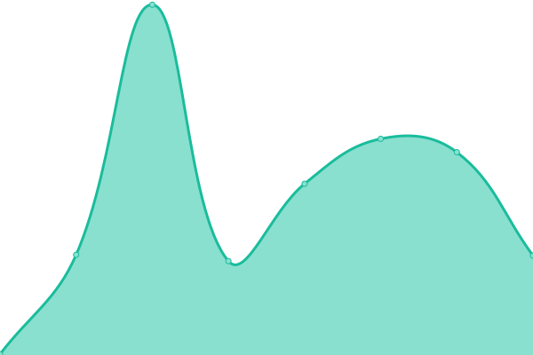
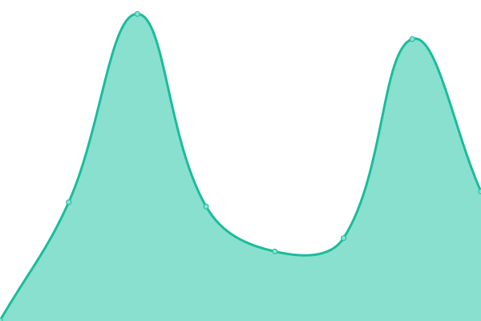

# [📈 Live Status](https://BinaryFiddler.github.io/upptime): <!--live status--> **🟩 All systems operational**

This repository contains the open-source uptime monitor and status page for [Chenyu Huang](chenyu.blog), powered by [Upptime](https://github.com/upptime/upptime).

With [Upptime](https://upptime.js.org), you can get your own unlimited and free uptime monitor and status page, powered entirely by a GitHub repository. We use [Issues](https://github.com/BinaryFiddler/upptime/issues) as incident reports, [Actions](https://github.com/BinaryFiddler/upptime/actions) as uptime monitors, and [Pages](https://BinaryFiddler.github.io/upptime) for the status page.

<!--start: status pages-->
<!-- This summary is generated by Upptime (https://github.com/upptime/upptime) -->
<!-- Do not edit this manually, your changes will be overwritten -->
<!-- prettier-ignore -->
| URL | Status | History | Response Time | Uptime |
| --- | ------ | ------- | ------------- | ------ |
|  [Chenyu blog](https://www.chenyu.blog) | 🟩 Up | [chenyu-blog.yml](https://github.com/BinaryFiddler/upptime/commits/HEAD/history/chenyu-blog.yml) | 

 367ms
     
 | 

<a href="https://status.chenyu.blog/history/chenyu-blog">100.00%</a>
    

|  [Weichen blog](https://www.weichen.blog) | 🟩 Up | [weichen-blog.yml](https://github.com/BinaryFiddler/upptime/commits/HEAD/history/weichen-blog.yml) | 

 392ms
     
 | 

<a href="https://status.chenyu.blog/history/weichen-blog">100.00%</a>
    

|  [Allen blog](https://www.liallen.me) | 🟩 Up | [allen-blog.yml](https://github.com/BinaryFiddler/upptime/commits/HEAD/history/allen-blog.yml) | 

 326ms
     
 | 

<a href="https://status.chenyu.blog/history/allen-blog">100.00%</a>
    

|  [Teng blog](https://www.teng.pub) | 🟩 Up | [teng-blog.yml](https://github.com/BinaryFiddler/upptime/commits/HEAD/history/teng-blog.yml) | 

 658ms
     
 | 

<a href="https://status.chenyu.blog/history/teng-blog">99.73%</a>
    

|  [Binaryfiddle](https://binaryfiddle.com) | 🟩 Up | [binaryfiddle.yml](https://github.com/BinaryFiddler/upptime/commits/HEAD/history/binaryfiddle.yml) | 

 604ms
     
 | 

<a href="https://status.chenyu.blog/history/binaryfiddle">100.00%</a>
    

<!--end: status pages-->

[**Visit our status website →**](https://BinaryFiddler.github.io/upptime)

## 📄 License

- Powered by: [Upptime](https://github.com/upptime/upptime)
- Code: [MIT](./LICENSE) © [Anand Chowdhary](https://anandchowdhary.com), supported by [Pabio](https://pabio.com)
- Data in the `./history` directory: [Open Database License](https://opendatacommons.org/licenses/odbl/1-0/)
